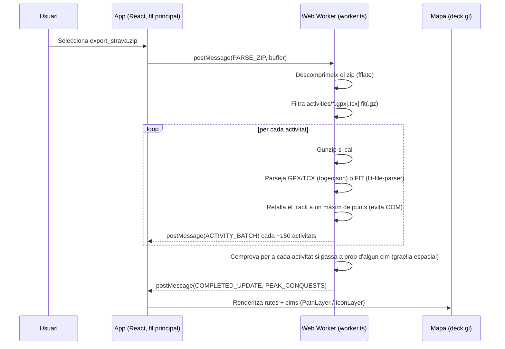

# 100 cims

Visualitza les teves activitats de Strava (o arxius GPX/TCX/FIT solts) sobre un mapa
i porta el control automàtic del **Repte 100 Cims** (FEEC): l'app detecta quins cims
has trepitjat mirant si alguna de les teves rutes passa a prop.

Tot el processament (descomprimir el `.zip`, llegir els GPX/TCX/FIT i calcular quins
cims has fet) passa **en local, al teu navegador**. Cap fitxer s'envia a cap servidor.

---

## Índex

- [Com descarregar la teva exportació de Strava](#com-descarregar-la-teva-exportació-de-strava)
- [Com importar les dades a l'app](#com-importar-les-dades-a-lapp)
- [Com funciona per dins](#com-funciona-per-dins)
- [Estructura del projecte](#estructura-del-projecte)
- [Desenvolupament local](#desenvolupament-local)
- [Limitacions conegudes](#limitacions-conegudes)

---

## Com descarregar la teva exportació de Strava

1. Ves a **[strava.com/account](https://www.strava.com/account)** (has d'haver iniciat sessió).
2. Baixa fins a la secció **"Descarrega la teva compte"** / **"Download your account"**.
3. Clica el botó de descàrrega. Strava et mostrarà un avís similar a:

   > **Descarrega tu cuenta**
   > Este archivo incluirá tus actividades, fotos, publicaciones, rutas y más.

4. Confirma la sol·licitud. Strava prepara l'arxiu al servidor (no és instantani).
5. **En menys d'1 minut** rebràs un correu electrònic (l'assumpte sol ser del tipus
   *"Your Strava data export"* / *"La teva exportació de dades de Strava"*) amb un
   enllaç de descàrrega.
6. Des del correu, descarrega el fitxer **`export_....zip`** (pot pesar desenes o
   centenars de MB, depenent de quantes activitats tinguis). **No cal descomprimir'l**:
   l'app llegeix directament el `.zip`.

> 💡 Dins d'aquest zip hi ha, entre altres coses, una carpeta `activities/` amb un
> fitxer `.gpx`, `.tcx` o `.fit` (de vegades comprimit amb `.gz`) per cada activitat,
> i un `activities.csv` amb el nom i la data de cadascuna. L'app només fa servir
> aquests dos elements.

---

## Com importar les dades a l'app

A la barra lateral esquerra hi ha dos botons:

- **"Importar exportació (.zip)"** → selecciona directament el `export_....zip` que
  t'ha arribat per correu. És la via recomanada perquè aprofita `activities.csv` per
  posar bé el nom i la data de cada activitat.
- **"Carregar arxius (.gpx/.fit)"** → si prefereixes penjar fitxers GPS solts (per
  exemple, exportats un a un des de Strava, o gravats amb un altre rellotge/app),
  pots seleccionar-ne diversos alhora amb aquest botó.

Un cop importat, veuràs:

1. Una barra de progrés mentre s'analitzen les activitats (tot passa en un *web
   worker*, així que la interfície no es bloqueja encara que hi hagi centenars
   d'arxius).
2. Les rutes dibuixades sobre el mapa.
3. Als panells de la barra lateral, el recompte de cims completats, percentatge del
   repte, desglossament per comarca/alçada, etc., calculat automàticament.

---

## Com funciona per dins

Flux general d'una importació:



### 1. Extracció (`src/worker.ts`)

- El `.zip` es descomprimeix amb [`fflate`](https://github.com/101arrowz/fflate)
  íntegrament dins d'un **Web Worker**, per no bloquejar la UI.
- Es filtren només les entrades que coincideixen amb `activities/*.gpx|.tcx|.fit(.gz)`.
- Si hi ha un `activities.csv` a l'exportació, es parseja per obtenir el nom i la
  data "bonics" de cada activitat (per si el fitxer GPS no els porta).

### 2. Lectura (`src/worker.ts`)

Segons l'extensió del fitxer:

| Format | Llibreria | Notes |
| --- | --- | --- |
| `.gpx` | `@tmcw/togeojson` + `@xmldom/xmldom` | Es converteix a GeoJSON i s'extreu la traça (`LineString`) |
| `.tcx` | `@tmcw/togeojson` + `@xmldom/xmldom` | Igual que GPX, però llegint el node `<Activity>` per l'esport i l'Id/data |
| `.fit` | `fit-file-parser` | Es recorren tots els registres (`records`, `sessions`, `laps`...) buscant `position_lat`/`position_long`, nom i data |

Cada activitat es normalitza a un objecte comú (`StravaActivity`):

```ts
{ id, name, type, date, distance, path: [lon, lat][] }
```

Per evitar problemes de memòria amb exportacions grans, les traces es **redueixen a
un màxim de 2000 punts** (`decimatePath`) abans de guardar-les — de sobres per
dibuixar-les bé i per fer la detecció de cims (que ja mostreja només ~500 punts).

### 3. Impressió al mapa (`src/components/MapView.tsx`)

- El mapa es renderitza amb **deck.gl** (`PathLayer` per les rutes, `IconLayer` /
  `ScatterplotLayer` per als cims) sobre tessel·les raster de CARTO
  (`react-map-gl` + `maplibre-gl`).
- Cada tipus d'activitat (Run, Ride, Walk, Swim...) té un color propi
  (`getActivityColor` a `src/types.ts`).

### 4. Càlcul de "quins cims has fet" (`src/worker.ts`)

Aquesta és la part "intel·ligent" de l'app:

1. Es carrega la llista de cims des de `muntanyesRepte100CimsFEEC.json` (nom,
   coordenades, alçada, si és "essencial", etc.).
2. Es construeix un **índex espacial en graella** (`buildGridIndex`): els cims es
   reparteixen en cel·les d'una mida proporcional al radi de proximitat, perquè no
   calgui comparar cada punt de cada ruta contra tots els cims (seria O(punts × cims)).
3. Per a cada activitat, es recorren els seus punts (mostrejats a ~500 com a màxim)
   i, per a cada punt, es miren només els cims de la cel·la corresponent i les 8
   veïnes.
4. Es calcula la distància real amb la **fórmula de Haversine**. Si és menor que el
   radi configurat (per defecte 250 m, ajustable des de la UI), el cim es marca com
   a **completat**.
5. També es guarda quina va ser la **primera activitat** que va "conquerir" cada cim
   (per mostrar-ho al popup del mapa).

Aquest càlcul es recalcula automàticament si canvies el radi de proximitat des de la
barra lateral, sense haver de tornar a importar les activitats.

---

## Estructura del projecte

```
index.html               Punt d'entrada HTML + metadades SEO
muntanyesRepte100CimsFEEC.json   Llistat dels cims del repte (nom, coordenades, alçada...)
src/
  App.tsx                 Estat global de l'app, comunicació amb el worker
  worker.ts                Tota la lògica pesada: unzip, parseig GPX/TCX/FIT, detecció de cims
  types.ts                 Tipus compartits (StravaActivity, Peak, colors per tipus d'activitat)
  components/
    MapView.tsx            Mapa (deck.gl + maplibre): rutes, cims, popups
    Sidebar.tsx             Panell lateral: importació, filtres, estadístiques
```

## Desenvolupament local

```powershell
npm install       # instal·la dependències
npm run dev       # servidor de desenvolupament (http://localhost:3000)
npm run build     # build de producció a dist/
npm run preview   # previsualitza el build
npm run lint      # comprova tipus amb tsc --noEmit
```

## Limitacions conegudes

- Només es processen activitats amb dades GPS (`activities/*.gpx|.tcx|.fit`, amb o
  sense `.gz`). Activitats sense traça (p. ex. entrenaments de gimnàs) es descarten.
- La detecció de cims és per proximitat (radi configurable), no per "cim exacte
  registrat a Strava"; ajusta el radi si veus falsos positius/negatius.
- Tot el processament és local al navegador: exportacions molt grans poden trigar
  una estona a analitzar-se, però no s'haurien de penjar (el worker allibera memòria
  progressivament mentre importa).

## Millores SEO ja aplicades

- Nom de l'app "100 cims" a `index.html`, `metadata.json`, `package.json` i la UI.
- Meta tags `title`, `description`, `keywords`, `canonical`, `og:*` i `twitter:card`.
- JSON-LD (`schema.org`) per `WebSite` i `Organization` a `index.html`.
- `public/robots.txt` i `public/sitemap.xml`.
- Imatge OG bàsica `public/assets/og.svg` i `site.webmanifest`.
